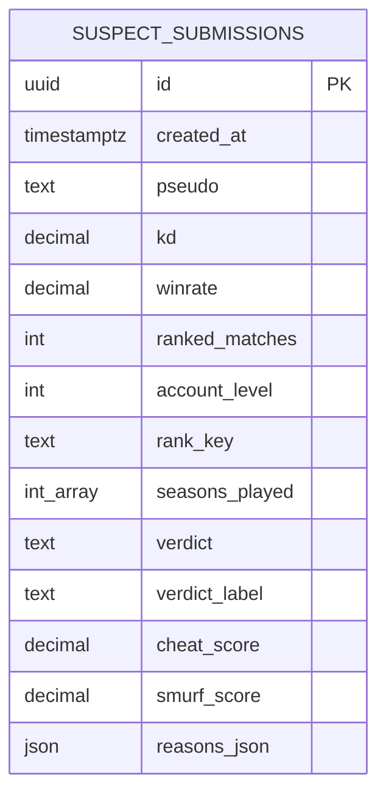

# Documentation base de données

La base de données de production est une base PostgreSQL hébergée sur Neon. L'application y accède uniquement côté serveur via Prisma et la variable `DATABASE_URL`.

## Diagramme ER



## Table `suspect_submissions`

| Colonne Prisma | Colonne SQL | Type | Null | Description |
| --- | --- | --- | --- | --- |
| `id` | `id` | `uuid` | Non | Identifiant public généré par PostgreSQL (`gen_random_uuid()`). |
| `createdAt` | `created_at` | `timestamptz` | Non | Date de sauvegarde de l'analyse. |
| `pseudo` | `pseudo` | `text` | Oui | Pseudo optionnel saisi par l'utilisateur. |
| `kd` | `kd` | `decimal(8,3)` | Non | K/D ranked saisi. |
| `winrate` | `winrate` | `decimal(6,2)` | Oui | Win rate ranked optionnel. |
| `rankedMatches` | `ranked_matches` | `integer` | Non | Nombre de matchs ranked. |
| `accountLevel` | `account_level` | `integer` | Non | Niveau du compte. |
| `rankKey` | `rank_key` | `text` | Oui | Rang courant normalisé. |
| `seasonsPlayed` | `seasons_played` | `integer[]` | Non | Saisons cochées dans le formulaire. |
| `verdict` | `verdict` | `text` | Non | Verdict machine court (`legit`, `uncertain`, `suspect`, etc.). |
| `verdictLabel` | `verdict_label` | `text` | Non | Libellé affichable du verdict. |
| `cheatScore` | `cheat_score` | `decimal(6,2)` | Non | Score suspicion triche entre 0 et 100. |
| `smurfScore` | `smurf_score` | `decimal(6,2)` | Non | Score smurf entre 0 et 100. |
| `reasonsJson` | `reasons_json` | `json` | Non | Raisons détaillées générées par l'analyse. |

## Contraintes et choix

- La clé primaire est un UUID, ce qui évite d'exposer un compteur incrémental.
- Les scores numériques sont stockés en décimal pour éviter les approximations d'affichage.
- `pseudo`, `winrate` et `rankKey` sont nullable car l'analyse peut être faite sans pseudo, sans WR précis ou sans rang courant.
- `reasons_json` est en JSON car la forme des raisons est orientée UI et peut évoluer sans migration immédiate.
- Le projet utilise une seule table : il n'existe pas de relation utilisateur car il n'y a pas de comptes.

## Accès aux données

Tous les accès applicatifs passent par Prisma :

- `prisma.suspectSubmission.create()` pour `POST /api/submissions`.
- `prisma.suspectSubmission.findMany()` et `count()` pour `GET /api/entries`.
- `aggregate()` et `groupBy()` pour `GET /api/stats`.

Aucune donnée utilisateur n'est concaténée dans une requête SQL brute.

## Seed

Le script de démonstration est :

```bash
npm run db:seed
```

Il lit `DATABASE_URL` depuis `.env.local` et insère des profils représentatifs pour tester immédiatement l'historique et les statistiques.

## Mise en place locale

```bash
cp .env.example .env.local
npm install
npm run db:push
npm run db:seed
npm run dev
```
