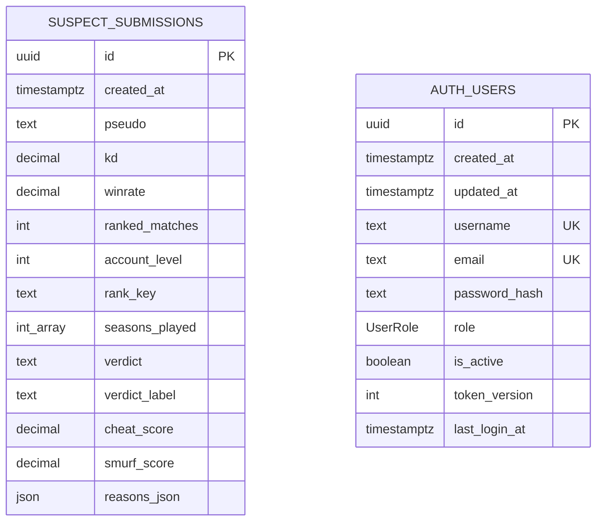

# Documentation base de données

La base de données de production est une base PostgreSQL hébergée sur Neon. L'application y accède uniquement côté serveur via Prisma et la variable `DATABASE_URL`.

## Diagramme ER



## Table `suspect_submissions`

| Colonne Prisma | Colonne SQL | Type | Null | Description |
| --- | --- | --- | --- | --- |
| `id` | `id` | `uuid` | Non | Identifiant public généré par PostgreSQL (`gen_random_uuid()`). |
| `createdAt` | `created_at` | `timestamptz` | Non | Date de sauvegarde de l'analyse. |
| `pseudo` | `pseudo` | `text` | Oui | Pseudo optionnel saisi par l'utilisateur. |
| `kd` | `kd` | `decimal(8,3)` | Non | K/D ranked saisi. |
| `winrate` | `winrate` | `decimal(6,2)` | Oui | Win rate ranked optionnel. |
| `rankedMatches` | `ranked_matches` | `integer` | Non | Nombre de matchs ranked. |
| `accountLevel` | `account_level` | `integer` | Non | Niveau du compte. |
| `rankKey` | `rank_key` | `text` | Oui | Rang courant normalisé. |
| `seasonsPlayed` | `seasons_played` | `integer[]` | Non | Saisons cochées dans le formulaire. |
| `verdict` | `verdict` | `text` | Non | Verdict machine court (`legit`, `uncertain`, `suspect`, etc.). |
| `verdictLabel` | `verdict_label` | `text` | Non | Libellé affichable du verdict. |
| `cheatScore` | `cheat_score` | `decimal(6,2)` | Non | Score suspicion triche entre 0 et 100. |
| `smurfScore` | `smurf_score` | `decimal(6,2)` | Non | Score smurf entre 0 et 100. |
| `reasonsJson` | `reasons_json` | `json` | Non | Raisons détaillées générées par l'analyse. |

## Table `auth_users`

| Colonne Prisma | Colonne SQL | Type | Null | Description |
| --- | --- | --- | --- | --- |
| `id` | `id` | `uuid` | Non | Identifiant public de l'utilisateur. |
| `createdAt` | `created_at` | `timestamptz` | Non | Date de création. |
| `updatedAt` | `updated_at` | `timestamptz` | Non | Date de dernière modification. |
| `username` | `username` | `text` | Non | Identifiant unique de login. |
| `email` | `email` | `text` | Oui | Email unique optionnel. |
| `passwordHash` | `password_hash` | `text` | Non | Hash `scrypt` du mot de passe. |
| `role` | `role` | `UserRole` | Non | `ADMIN`, `MODERATOR` ou `VIEWER`. |
| `isActive` | `is_active` | `boolean` | Non | Désactive un utilisateur sans le supprimer. |
| `tokenVersion` | `token_version` | `integer` | Non | Invalidation serveur des JWT au logout. |
| `lastLoginAt` | `last_login_at` | `timestamptz` | Oui | Dernier login réussi. |

## Index

| Index | Colonnes | Rôle |
| --- | --- | --- |
| `suspect_submissions_created_at_idx` | `created_at DESC` | Tri par date dans l'historique. |
| `suspect_submissions_verdict_idx` | `verdict` | Filtre par verdict. |
| `suspect_submissions_rank_key_idx` | `rank_key` | Filtre par rang. |
| `auth_users_role_idx` | `role` | Filtre des utilisateurs par rôle. |
| `auth_users_is_active_idx` | `is_active` | Exclusion rapide des comptes désactivés. |

## Contraintes et choix

- La clé primaire est un UUID, ce qui évite d'exposer un compteur incrémental.
- Les scores numériques sont stockés en décimal pour éviter les approximations d'affichage.
- `pseudo`, `winrate` et `rankKey` sont nullable car l'analyse peut être faite sans pseudo, sans WR précis ou sans rang courant.
- `reasons_json` est en JSON car la forme des raisons est orientée UI et peut évoluer sans migration immédiate.
- `auth_users` est séparée de `suspect_submissions` : les analyses restent des observations indépendantes, pas des données personnelles liées à un compte public.

## Accès aux données

Tous les accès applicatifs passent par Prisma via `lib/repositories/submission-repository.js` :

- `create()` pour `POST /api/v1/submissions`.
- `findManyWithCount()` pour `GET /api/v1/entries`.
- `findForExport()` pour `GET /api/v1/export.csv`.
- `getStats()` pour `GET /api/v1/stats`.

Aucune donnée utilisateur n'est concaténée dans une requête SQL brute.

## Seed

Le script de démonstration est :

```bash
npm run db:seed
```

Il lit `DATABASE_URL` depuis `.env.local`, crée ou met à jour les utilisateurs `admin`, `moderator` et `viewer`, supprime les lignes de démonstration `Demo.*` existantes puis insère 5 profils représentatifs recalculés par `lib/analyze.js`. Le seed est donc idempotent : le relancer ne duplique pas les lignes de démonstration.

## Mise en place locale

```bash
cp .env.example .env.local
npm install
npm run db:push
npm run seed
npm run dev
```
