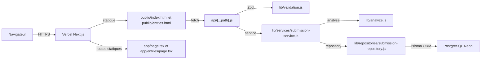

# R6 Suspect Check — documentation technique

Ce document résume l'état réel du dépôt pour la soutenance. Les détails exhaustifs sont dans `README.md`, `docs/API.md`, `docs/DB.md`, `docs/SECURITY.md` et `docs/FRONTEND.md`.

## Vue d'ensemble

R6 Suspect Check est un outil web d'aide à la vérification manuelle de profils Rainbow Six Siege ranked. L'utilisateur saisit des statistiques visibles sur R6 Tracker, l'application calcule des scores `cheat` et `smurf`, affiche des raisons explicables, puis peut sauvegarder l'analyse dans PostgreSQL.

L'application ne prouve pas la triche. Elle produit un signal argumenté pour décider si un profil mérite une revue humaine.

## Architecture réelle



Une seule fonction serverless Vercel est utilisée : `api/[...path].js`. Ce choix évite de dépasser la limite du plan Hobby.

## Flux principal

1. Le navigateur ouvre `/` ; Next redirige statiquement vers `/index.html`.
2. Le formulaire dans `public/index.html` collecte K/D, win rate, matchs ranked, niveau, rang et saisons.
3. Le frontend affiche un premier verdict local pour un retour immédiat.
4. Si l'utilisateur sauvegarde, `POST /api/v1/submissions` valide le body puis recalcule le verdict côté serveur avec `lib/analyze.js`.
5. Le service crée la ligne via Prisma dans `suspect_submissions`.
6. `/entries` redirige vers `/entries.html`, qui charge l'historique via `GET /api/v1/entries`.
7. Les stats et l'export CSV utilisent la même couche service/repository.

## Structure du dépôt

```text
api/[...path].js                    Routeur Vercel unique
app/page.tsx                        Redirect statique vers /index.html
app/entries/page.tsx                Redirect statique vers /entries.html
public/                             UI statique
lib/analyze.js                      Moteur heuristique testable
lib/validation.js                   Schémas Zod
lib/api-response.js                 Erreurs et headers API
lib/services/submission-service.js  Logique applicative submissions
lib/repositories/submission-repository.js  Accès Prisma
prisma/schema.prisma                Modèle Prisma
prisma/seed.cjs                     Seed idempotent
```

## API

Les endpoints publics versionnés sont :

- `POST /api/v1/analyze`
- `POST /api/v1/submissions`
- `GET /api/v1/entries`
- `GET /api/v1/export.csv`
- `GET /api/v1/stats`
- `POST /api/v1/auth/login`
- `GET /api/v1/auth/me`

Les routes d'écriture utilisent `x-save-key` en production. Les routes de lecture de données utilisent `x-read-key` en production. Les erreurs sont normalisées avec `{ error: { code, message, details? } }`.

## Base de données

La base PostgreSQL contient une table principale `suspect_submissions`. Les colonnes stockent les stats saisies, le verdict recalculé serveur, les scores et les raisons JSON.

Les index utiles sont :

- `created_at DESC` pour l'historique.
- `verdict` pour les filtres.
- `rank_key` pour les filtres.

## Sécurité

- Validation serveur via Zod avant toute logique métier.
- Prisma ORM uniquement, pas de SQL concaténé.
- Headers de sécurité globaux dans `next.config.ts`.
- Headers API dans `lib/api-response.js`.
- Secrets hors repo via `.env.local` ou Vercel Environment Variables.
- Gitleaks en CI.
- Hash admin `scrypt`, JWT HMAC SHA-256 expirant en 15 minutes.

## Tests et qualité

Commandes principales :

```bash
npm run lint
npm run typecheck
npm test
npm run vercel-build
npm run check
```

Les tests couvrent le moteur d'analyse, la validation API, l'authentification, le routeur API et le service qui recalcule l'analyse côté serveur.

## Limites assumées

- Pas de compte utilisateur public ni de RBAC complet.
- Pas de domaine custom configuré dans le repo.
- Pas de scraping R6 Tracker.
- Pas de modèle IA entraîné.
- Frontend vanilla encore partiellement monolithique.
